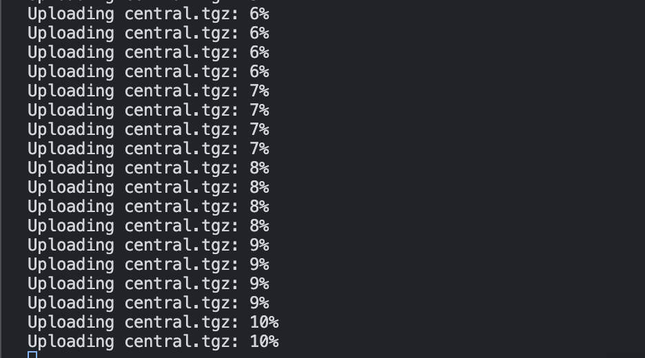

# Upload file to s3 using nodejs

    npm i 
    # Update the .env with your credentials
    mv .env.example .env
    # Create a folder with the files
    mkdir files
    # Run script
    node index.js

# It shows current percentage of upload !

